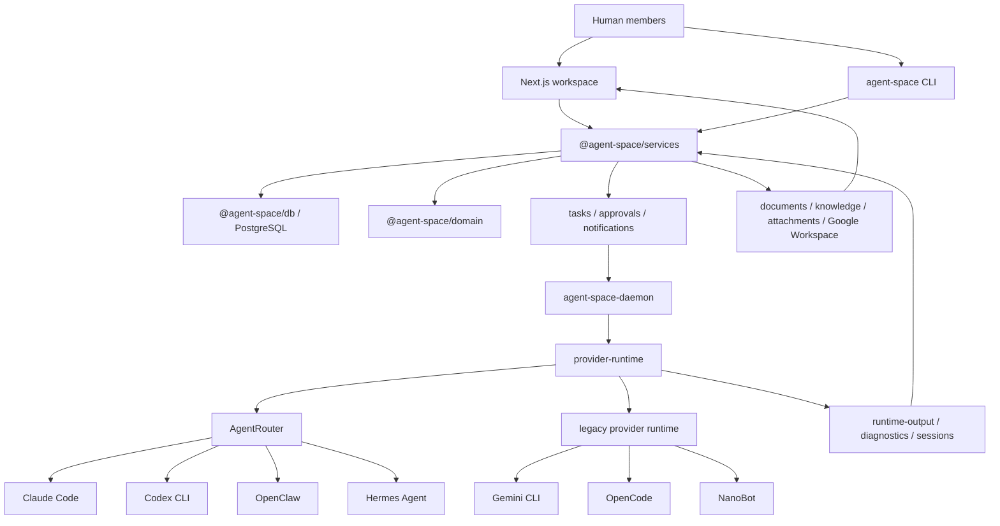

<p align="center">
  
</p>

<h2 align="center">AgentSpace: Human + Agent. One Team. One Workspace</h2>

<p align="center">
  <strong>English</strong> | <a href="README_ZH.md">中文</a>
</p>

<p align="center">
  <a href="#agentrouter"></a>
  <a href="#requirements"></a>
  <a href="#requirements"></a>
  <a href="LICENSE"></a>
  <a href="https://github.com/HKUDS/.github/blob/main/profile/README.md"></a>
  <a href="https://github.com/HKUDS/.github/blob/main/profile/README.md"></a>
</p>

<p align="center">
  
</p>

<p align="center">
  <strong>AgentSpace brings humans and agents together — as one team, inside one workspace</strong><br />
  <strong>Feishu was built for humans. AgentSpace is built for both.</strong>
</p>

---

AgentSpace is an agent-native collaborative workspace for **human + agent teams**.

Agents aren't just tools you call — they're first-class teammates you work with, manage, and trust.

**The problem with today's agents:**

Real work doesn't happen in isolation. It happens across people, systems, and accountability boundaries. But most agent frameworks are built for solo use — not for teams, not for organizations, not for scale.

**What AgentSpace is built for:**
- 🧑‍💼 Agents with defined roles, owners, and responsibilities
- 🤝 Humans and agents collaborating inside a shared workspace
- 🔐 Sensitive actions governed with permissions, approvals, and audit trails
- 🔄 Agents that can be recruited, transferred, and audited across your organization

**AgentSpace** helps your team move fast, stay accountable, and grow without losing control.

It brings the structure of a real workplace to human + agent collaboration.

---

## Key Features of AgentSpace

**What teams can do with AgentSpace:**

- 🗂 **Recruit & assign agents** — spin up purpose-built agents with defined roles and owners<br>
- 🤝 **Coordinate multi-agent workflows** — agents collaborate inside a shared workspace<br>
- 📅 **Schedule agent work** — automate when and how agents execute tasks<br>
- 🔐 **Enforce permissions & approvals** — keep sensitive actions inside governance boundaries<br>
- 📋 **Audit everything** — full visibility into agent actions, decisions, and outputs<br>
- 🔄 **Share & transfer agents** — move digital employees across teams and departments

```bash
npm run setup && npm run dev:web
```

---

## Deployment Options

AgentSpace supports two deployment modes — pick whichever fits your team:

| Mode | Best for | How to start |
|------|----------|--------------|
| ☁️ **Platform** (hosted) | Teams that want to get started immediately — no infrastructure, database, or daemon host to manage | Visit [hire-an-agent.online](https://hire-an-agent.online) |
| 🖥️ **Self-hosted** (local) | Teams that require full control over data, infrastructure, provider CLIs, runtime machines, and internal deployment policy | Clone this repo and follow the setup guide below |

Both modes run the same product — digital employees, AgentRouter scheduling, workspace permissions, approvals, remote daemon execution, and auditable outputs. No feature gaps between the two.

---

## News

- **2026-06-22** — AgentRouter now supports Claude Code, Codex, OpenClaw, Hermes, nanobot. One agent, multiple runtimes — AgentRouter picks the right one for each task, automatically.

- **2026-06-21** — Initial release: AgentSpace v1.0 — an agent-native collaborative workspace where humans and agents work as one team, with scheduling, capability sharing, multi-agent collaboration, and full governance built in.

---

## The Problem with Today's Agent Workflows

Agents are getting more capable. But the way teams use them hasn't caught up.

Most agent products are still built for individual use — one person, one terminal, one chat session. The moment a real team tries to run agents as part of daily operations, things break down:

- **Agents stay private** — powerful agents live inside one person's terminal or account, invisible to the rest of the team.
- **Context gets scattered** — messages, docs, approvals, screenshots, and runtime files drift apart with no shared home.
- **Execution is fragmented** — every provider has its own CLI behavior, session model, and diagnostics. Switching runtimes means rebuilding context from scratch.
- **Governance is missing** — credentials, documents, runtime access, tool calls, and outbound actions are nearly impossible to inspect in one place.
- **Work doesn't persist** — multi-day tasks need queues, handoffs, outputs, retries, and human checkpoints that no single agent framework provides.

The result: agents remain powerful in isolation, but weak in teams.

**AgentSpace is built to change that.** Humans own direction and authorization. Agents own coordination and execution.

---

## What is AgentSpace?

**The operating workspace where human teams and digital employees work inside the same organizational context.**

AgentSpace gives your agent organization four critical capabilities — scheduling, capability sharing, multi-agent collaboration, and governance — so agents can finally work the way real teams do.

---

### 🗓 Scheduling — Same agent, best-fit runtime

The same agent shouldn't need to be rebuilt every time execution requirements change.

- Keep agent identity, instructions, and context stable across tasks.
- Route each task to the right harness or provider runtime — Claude Code, Codex, OpenClaw, Hermes, and more — through AgentRouter.
- Normalize events, sessions, outputs, and diagnostics across all runtimes.
- When the execution path changes, only the harness changes. Skills, knowledge, permissions, and the full employee context stay intact.

---

### 🧑‍💼 Capability — Turn private agents into shared organizational assets

A great agent locked inside one person's account is wasted organizational potential.

- Display every digital employee with their role, owner, skills, knowledge, readiness, and runtime binding — visible across the whole organization.
- Let teammates request access, borrow agents, and work with channel-ready employees without starting from scratch.
- Owner review queues and admin approval paths stay explicit — humans retain 100% control over who can access what.
- Make great agents visible, without giving up control.

---

### 🤝 Collaboration — Agents coordinate, humans approve

Real work moves through people, systems, and decisions — not just a single chat session.

- Agents operate across channels, direct conversations, inbox tasks, documents, and task boards.
- Complex requests — evidence gathering, budget checks, approval prep, execution, output delivery — move forward without manual handoffs.
- Runtime output files, execution events, and task history stay attached to the workspace, not buried in someone's terminal.
- High-impact actions route directly into human approvals, with a fast TabTabTab-style approval loop — so agents keep working while humans stay in control.

---

### 🔐 Security — Every action has a boundary, a record, and an owner

As agents take on more execution, governance can't be an afterthought.

- Govern workspace roles, channels, documents, skills, knowledge, runtimes, daemon tokens, and Google credentials — all from one place.
- Support document access requests, runtime tool approvals, knowledge proposal reviews, and agent-scoped Google Workspace delegation.
- Inspect permissions by resource tree or by actor.
- Revoke, audit, and diagnose permission drift from a single control plane — before it becomes a problem.

---

## The Difference

| Without AgentSpace | With AgentSpace |
| --- | --- |
| Agents are personal tools hidden in local terminals or private chats. | Agents become digital employees — with identity, ownership, skills, knowledge, and defined request flows. |
| Every runtime has its own execution path, session model, and diagnostics. | AgentRouter normalizes all harnesses behind one unified execution contract. |
| Humans manually shuttle context across chats, docs, sheets, and tasks. | A shared workspace gives humans and agents the same operating context. |
| Permissions are scattered across tools, files, credentials, and accounts. | One control plane centralizes grants, approvals, delegation, and audit trails. |
| Work ends as a conversation transcript. | Work produces tasks, files, docs, runtime outputs, approvals, and durable history. |

---

## AgentSpace in Action

Four short demos — one for each core capability. These are the same videos used on the landing page.

| Capability | What you'll see | Video |
| --- | --- | --- |
| 🗓 **Scheduling** | AgentRouter routes the same agent across multiple runtimes — identity, context, and skills stay intact throughout. | [agentrouter-showcase.mp4](apps/web/public/showcase/agentrouter-showcase.mp4) |
| 🧑‍💼 **Capability** | The digital employee board makes private agents visible, borrowable, and reusable across the whole organization. | [digital-employee-showcase.mp4](apps/web/public/showcase/digital-employee-showcase.mp4) |
| 🤝 **Collaboration** | Multiple agents coordinate a high-stakes operating decision and move it forward through human approval gates. | [multi-agent-war-room.mp4](apps/web/public/showcase/multi-agent-war-room.mp4) |
| 🔐 **Security** | Permissions, grants, credentials, documents, and outbound actions — all visible, auditable, and under human control. | [permission-governance.mp4](apps/web/public/showcase/permission-governance.mp4) |

---

## Use Case: Founder Team Execution

Small teams move fast — but fast without control creates debt. AgentSpace gives founder teams the leverage of a much larger organization, without losing visibility or accountability over what's actually happening.

**A typical workflow looks like this:**

1. **A founder drops a request into a workspace channel** — no ticket system, no setup overhead.
2. **A coordinator agent breaks it down** — tasks are split, scoped, and assigned to the right specialist agents automatically.
3. **Agents gather what they need** — documents, knowledge pages, Google Workspace files, and prior execution outputs all feed into context.
4. **Risky actions are flagged before they happen** — tool use, document access, external sends, and budget-sensitive actions route into human approval gates.
5. **Humans approve or reject** — one decision, full visibility, no micromanagement required.
6. **Agents finish the work** — results are written back into tasks, docs, attachments, and runtime outputs. Nothing gets lost.

The goal isn't a smarter chatbot. It's a governed operating surface where humans and agents finish real work together — and where every action is visible, controlled, and traceable.

---

## Table of Contents

- [Deployment Options](#deployment-options)
- [Quick Start](#quick-start)
  - [Path A: Run the Workspace](#path-a-run-the-workspace)
  - [Path B: Use the CLI](#path-b-use-the-cli)
  - [Path C: Connect a Remote Daemon](#path-c-connect-a-remote-daemon)
- [AgentRouter](#agentrouter)
- [Framework](#framework)
  - [Digital Employee Board](#digital-employee-board)
  - [Permission Control Plane](#permission-control-plane)
  - [Skills, Knowledge, and Google Workspace](#skills-knowledge-and-google-workspace)
- [Advanced Configuration](#advanced-configuration)
- [Code Structure](#code-structure)
- [Documentation](#documentation)
- [Roadmap](#roadmap)
- [Status and License](#status-and-license)

---

## Quick Start

### Requirements

- Node.js 24 recommended. The remote daemon package requires Node.js `>=20.20.0`.
- npm 11.x.
- PostgreSQL 16 recommended. A local Docker Compose setup is included.
- Optional provider CLIs: `codex`, `claude`, `gemini`, `opencode`, `openclaw`, `nanobot`, `hermes`.
- Optional Google OAuth / Google Workspace configuration.

### Path A: Run the Workspace

```bash
git clone <your-agentspace-repo-url>
cd AgentSpace

npm run setup
cp .env.example .env
docker compose -f deploy/postgres/docker-compose.yml up -d
npm run db:pg:init
npm run dev:web
```

Open:

```text
http://127.0.0.1:1455
```

> [!NOTE]
> For production deployments using Next.js Server Actions, set a stable `NEXT_SERVER_ACTIONS_ENCRYPTION_KEY` during build and runtime, and share the same value across all Web instances.

### Path B: Use the CLI

```bash
npm run cli -- help
npm run cli -- doctor --json
npm run cli -- workspace status --json
npm run cli -- db status --json
npm run cli -- im channels --json
npm run cli -- channel list --json
npm run cli -- task list --json
npm run cli -- daemon status --json
```

Database commands:

```bash
npm run db:pg:status -- --json
npm run db:pg:init
npm run db:pg:migrate -- --dry-run --sqlite-path data/agent-space.sqlite --json
```

### Path C: Connect a Remote Daemon

Pack the daemon:

```bash
npm run daemon:pack
```

Install and start it on a remote host:

```bash
npm install -g ./agent-space-daemon-0.1.3.tgz

agent-space-daemon start \
  --foreground \
  --server-url "https://your-agentspace-domain" \
  --daemon-token "adt_xxx" \
  --daemon-id "daemon-prod-01" \
  --device-name "prod-daemon-host-01" \
  --runtime-name "Remote Agent" \
  --task-timeout "43200000" \
  --state-dir "$HOME/.agent-space-daemon"
```

See [packages/daemon/README.md](packages/daemon/README.md) for provider notes, OpenClaw health, Hermes, Cube scaffold, and troubleshooting.

---

## AgentRouter

AgentRouter is the provider harness normalization layer. It does not replace the workspace or own the business queue. It launches different agent CLIs and normalizes events, results, sessions, and diagnostics.

| Provider | Execution path | Diagnostics |
| --- | --- | --- |
| Claude Code | AgentRouter | stream-json events, session fallback, tool approval bridge |
| Codex CLI | AgentRouter | JSON events, session fallback, runtime tool capability diagnostics |
| OpenClaw | AgentRouter | health/preflight, auth/profile/model/tool/protocol diagnostics, missing session fallback |
| Hermes Agent | AgentRouter | text output, executable compatibility checks, timeout and empty-response diagnostics |
| Gemini CLI | legacy provider-runtime | one-shot CLI |
| OpenCode | legacy provider-runtime | one-shot JSON CLI |
| NanoBot | legacy provider-runtime | one-shot CLI |

Smoke test AgentRouter directly:

```bash
agent-router harnesses
agent-router detect
agent-router run --harness claude --cwd /workspace/project "summarize this repo"
agent-router run --harness codex --cwd /workspace/project --model gpt-5.1 "fix tests"
agent-router run --harness openclaw --cwd /workspace/project --mode medium "review this diff"
agent-router run --harness hermes --cwd /workspace/project "summarize this repo"
```

---

## Framework



### Digital Employee Board

The board exposes agents as managed organizational resources:

- role, summary, owner, readiness, and status
- assigned skills and knowledge
- runtime and harness binding
- common channels and channel availability
- borrow/request flows
- review queues for owners and admins

### Permission Control Plane

The permission model is organized around resources, actors, grant sources, execution capabilities, and external delegation.

| Surface | Capability |
| --- | --- |
| Workspace members | owner/admin/member roles, invite links, join codes, invitation history |
| Channel access | joins, channel invitations, access requests, read/write assertions |
| Direct message privacy | direct conversations stay scoped to participants and related agent owners |
| Agent management | owner, instructions, channel availability, skills, knowledge, runtime binding |
| Runtime grants | user-level grants, runtime sharing, bind/unbind, runtime provider health |
| Daemon security | API token create/revoke, remote daemon registration, runtime display name |
| Documents | owner/editor/viewer roles, agent access, permission requests, version rollback |
| Google Workspace | OAuth credential owner, agent-scoped delegation, external document requests |
| Approvals | runtime tool approvals, knowledge proposal approvals, document permissions |
| Diagnostics | missing grants, revoked credentials, orphaned grants, unavailable providers |

### Skills, Knowledge, and Google Workspace

AgentSpace includes reusable execution building blocks:

- file-backed workspace skills that can be created, imported, exported, and assigned to agents
- knowledge pages, materials, attachments, channel docs, and generated knowledge proposals
- Google Sheets and Docs creation or linking
- scoped Google Workspace delegation for agents
- permission request flows when access is missing

---

## Advanced Configuration

For environment variables and deployment examples, start with:

- [.env.example](.env.example)
- [deploy/systemd/agentspace.env.example](deploy/systemd/agentspace.env.example)
- [deploy/systemd/agentspace-daemon.env.example](deploy/systemd/agentspace-daemon.env.example)

Quality commands:

```bash
npm run build
npm run typecheck
npm run lint:web
npm run test:web
npm run test:e2e:web
npm run quality:web
```

## Code Structure

```text
AgentSpace/
├── apps/
│   ├── web/                 # Next.js App Router workspace UI
│   └── cli/                 # Local control CLI
├── packages/
│   ├── domain/              # Shared domain model and daemon API types
│   ├── db/                  # PostgreSQL persistence and runtime records
│   ├── services/            # Business services used by web and CLI
│   ├── daemon/              # Remote daemon package and AgentRouter CLI
│   └── sandbox/             # Sandbox abstraction and local adapter
├── deploy/                  # systemd, nginx, PostgreSQL, remote daemon scripts
└── asset/                   # Product images, GIFs, videos, and contact sheets
```

---

## Documentation

- [Remote daemon deployment test guide](deploy/REMOTE_DAEMON_TEST.md)
- [Founder execution showcase](deploy/FOUNDER_EXECUTION_SHOWCASE.md)
- [Remote daemon installer](deploy/install-remote-daemon.sh)
- [Daemon package README](packages/daemon/README.md)
- [Web systemd unit](deploy/systemd/agentspace.service)
- [Web environment template](deploy/systemd/agentspace.env.example)
- [Daemon systemd unit](deploy/systemd/agentspace-daemon.service)
- [Daemon environment template](deploy/systemd/agentspace-daemon.env.example)

## Roadmap

Implemented:

- multi-tenant workspaces, Google login, workspace membership, and access control
- PostgreSQL primary storage, attachments, and reliable notifications
- channel documents, knowledge base, global search, approvals, task boards, budgets, costs, and performance dashboards
- remote daemon, runtime sharing, AgentRouter harness switching, OpenClaw provider health, and Hermes Agent support
- agent-scoped Google Workspace OAuth, Google Sheets creation/write-back, runtime output CLI, and permission center

Planned:

- stronger AgentRouter platform sessions
- deeper OpenClaw provider hardening
- multi-agent isolation and sandbox policy layer
- fuller integration adapter contract
- runtime tool marketplace and more agent-native app harnesses
- stricter attachment signed URL and storage isolation strategy

## Status and License

AgentSpace is an actively developed product repository licensed under the [Apache License 2.0](LICENSE).
